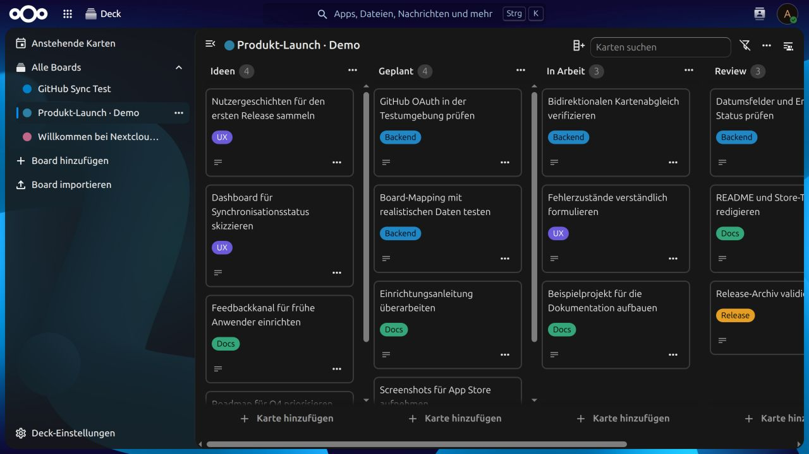
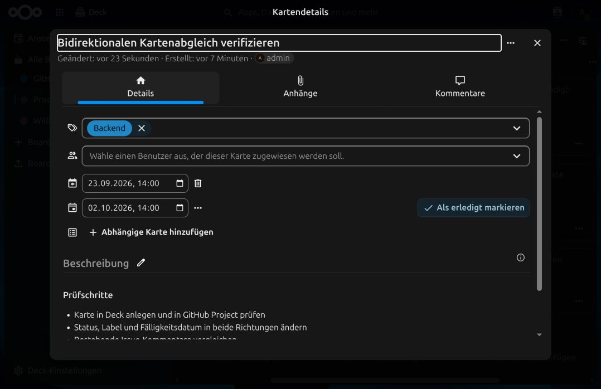
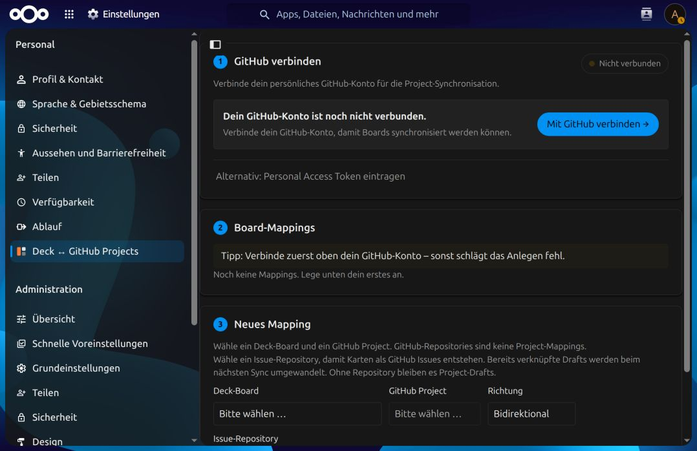

# Deck ↔ GitHub Projects Sync

Sync Nextcloud Deck boards with GitHub Projects v2. Choose a sync direction for each mapping and for individual fields, then let a background job keep both sides up to date.

Test a new mapping with disposable boards before using it for important work.

## Preview

The screenshots use a sample product-launch board in a local Nextcloud installation. They show the Deck data model and the app's setup screen; they do not represent a completed GitHub sync.

| Demo board | Card details |
| --- | --- |
|  |  |



## What it does

- Maps a Deck board to a GitHub Project v2 and Deck stacks to its **Status** options.
- Creates and updates cards and Project items in both directions. Without a repository, items are Project drafts; with a repository, the app uses GitHub Issues.
- Syncs title, description, labels, assignees, start and due dates, completion state, and comments. Each field can be set to both directions, one direction, or off.
- Offers GitHub OAuth or a personal access token for each user. A GitHub App can provide server-side credentials.
- Runs on Nextcloud background jobs, with manual sync and an optional GitHub webhook.

Deck attachments stay in Nextcloud. Assignees require a GitHub-to-Nextcloud user mapping. Pull requests appear as read-only Deck cards. Existing Issues are not moved between repositories.

## Requirements

- Nextcloud 30–36 and the **Deck** app
- A GitHub account with access to a Project v2
- System cron for scheduled sync
- GitHub OAuth app or a suitable personal access token; a GitHub App is optional

## Install and configure

Until an App Store release is available, follow the [manual installation and setup guide](docs/SETUP.md). The repository includes built frontend assets, so installing from source does not require Node.js on the Nextcloud server.

1. Enable Deck and install this app in a Nextcloud app directory named `deckgithubsync`.
2. Configure a GitHub OAuth app in the Nextcloud admin settings, or connect with a personal access token.
3. In personal settings, select a Deck board and GitHub Project. Optionally choose an Issue repository.
4. Choose sync directions and user mappings, then run a manual sync on test data.
5. Enable system cron and, if needed, a GitHub webhook.

See [usage](docs/USAGE.md), [architecture](docs/ARCHITECTURE.md), [API](docs/API.md), and [troubleshooting](docs/TROUBLESHOOTING.md).
Maintainers can use the [release guide](docs/RELEASE.md) for App Store packaging and signing.

## Development

```bash
npm ci
npm run build
```

The build writes JavaScript to `js/` and CSS to `css/`, where Nextcloud expects them. Both directories are included in releases. The PHP unit tests live under `tests/Unit/` and run inside a Nextcloud server checkout.

Issues and suggestions: [GitHub Issues](https://github.com/SchVinzenz/Github-Projects-for-Deck/issues). Licensed under [AGPL-3.0-or-later](LICENSE).
